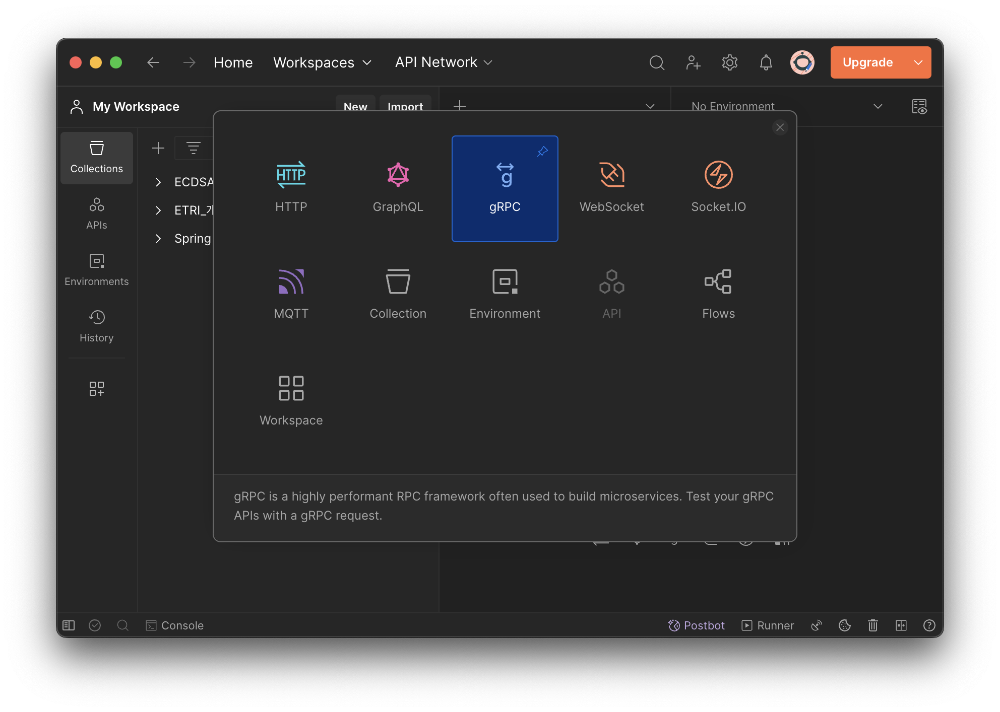
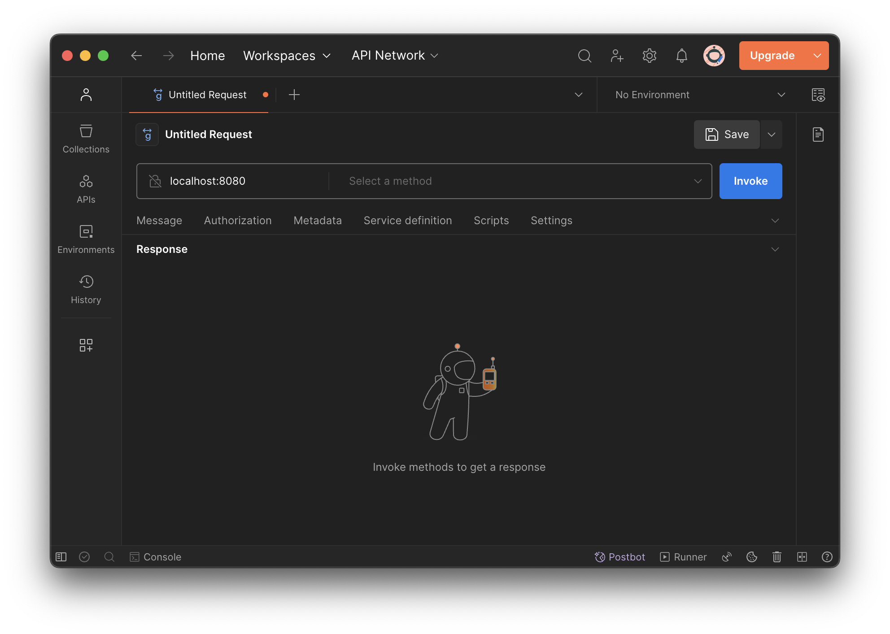
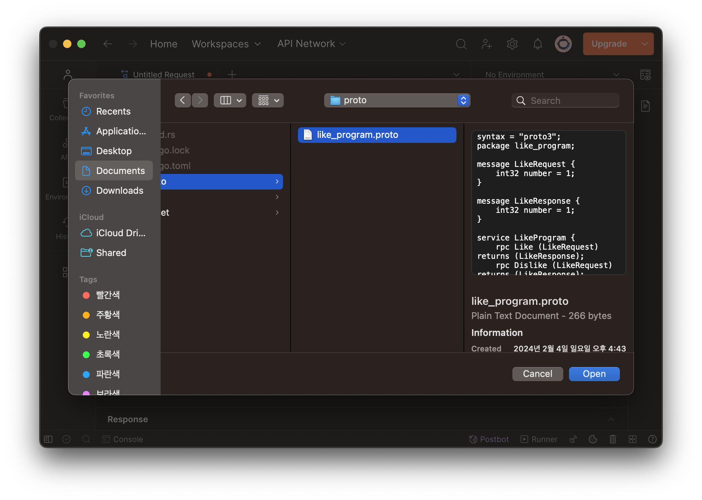

# 좋아요/별로에요 서버 개발

## gRPC Server (Rust)

개발환경  
- Rust

## 서버 개발하기

### 1. 프로젝트 생성

`cargo`를 사용하여 프로젝트를 생성합니다.

```shell
cargo new server
```

### 2. 디펜던시 추가

디펜던시를 추가합니다. `cors` 관련한 디펜던시를 같이 추가하는데 지금은 사용하지 않지만 미리 추가하도록 하겠습니다.

```shell
cargo add tonic@0.9.2
cargo add tonic-web@0.9.2 ## cros 설정으로 추가
cargo add tower-http@0.4.3 --features "cors"
cargo add tonic-build@0.9.2 --build
cargo add http@0.2.9
cargo add prost@0.11.9
cargo add tokio --features "tokio/macros, tokio/rt-multi-thread"
```

우리가 추가한 디펜던시는 `Cargo.toml` 파일에서 확인 할 수 있습니다.  

`Cargo.toml` 내용:  
```text
[package]
name = "server"
version = "0.1.0"
edition = "2021"

# See more keys and their definitions at https://doc.rust-lang.org/cargo/reference/manifest.html

[dependencies]
http = "0.2.9"
prost = "0.11.9"
tokio = { version = "1.31.0", features = ["macros", "rt-multi-thread"] }
tonic = "0.9.2"
tonic-web = "0.9.2"
tower-http = { version = "0.4.3", features = ["cors"] }

[build-dependencies]
tonic-build = "0.9.2"
```

### 3. protocol buffers 작성

`proto` 폴더를 생성합니다.

```shell
# 폴더 위치 : server/proto
mkdir proto
```

`protocol buffers` 를 사용하여 gRPC 통신합니다. `protocol buffers` 는 `.proto` 확장자를 사용합니다.  
우리는 간단하게 좋아요(더하기)/별로에요(빼기) 서비스를 만들도록 하겠습니다. `proto` 폴더안에 `like_program.proto` 파일을 생성합니다.  
`like_program.proto` 파일 내용:  
```text
syntax = "proto3";
package like_program;

message LikeRequest {
    int32 number = 1;
}

message LikeResponse {
    int32 number = 1;
}

service LikeProgram {
    rpc Like (LikeRequest) returns (LikeResponse);
    rpc Dislike (LikeRequest) returns (LikeResponse);
}

```
- `message` 는 통신할때 사용하는 구조체 입니다.  
- `service` 는 서비스 인터페이스 입니다.  

### 4. 빌드(tonic generate) 소스코드 작성

`tonic-build` 를 사용하여 앞에서 작성한 `proto` 파일 내용으로 서비스를 생성해주도록 정의합니다. `server/build.rs` 파일을 생성합니다.  
`build.rs` 파일 내용:
```rust
fn main () {
    let out_dir = std::path::PathBuf::from("src");
    tonic_build::configure()
    .out_dir(out_dir)
    .compile(&["proto/like_program.proto"], &[""])
    .unwrap();
}
```

앞에서 작성한 `like_program.proto` 파일을 빌드합니다.

```shell
cargo build
```
빌드 파일로 `like_program.rs` 파일이 생성됩니다.  
폴더 구조:
```text
server
├── Cargo.lock
├── Cargo.toml
├── build.rs
├── proto
│   └── like_program.proto
└── src
    ├── like_program.rs # 빌드로 생성된 파일
    └── main.rs
```

### 4. 비지니스(서비스) 소스코드 작성

좋아요(더하기)/별로에요(빼기) 서비스를 작성합니다.  
`service.rs` 파일을 생성합니다.(파일위치: `server/src/service.rs`)  
`service.rs` 파일 내용:
```rust
use tonic::{Request, Response, Status};
use like_program::{LikeRequest, LikeResponse, like_program_server::LikeProgram};

pub mod like_program {
    include!("like_program.rs");
}

#[derive(Debug, Default)]
pub struct LikeProgramService {}

#[tonic::async_trait]
impl LikeProgram for LikeProgramService {
    async fn like(
        &self,
        requst: Request<LikeRequest>
    ) -> Result<Response<LikeResponse>, Status> {
        let req = requst.into_inner();
        let mut number: i32 = req.number;
        // println!("request::number: {:?}", number);
        number += 1;
        Ok(Response::new(like_program::LikeResponse {
            number
        }))
    }

    async fn dislike(
        &self,
        requst: Request<LikeRequest>
    ) -> Result<Response<LikeResponse>, Status> {
        let req = requst.into_inner();
        let mut number: i32 = req.number;
        // println!("request::number: {:?}", number);
        number -= 1;
        Ok(Response::new(like_program::LikeResponse {
            number
        }))
    }
}
```

### 5. 서버 소스코드 작성
`main.rs` 내용에 서버 통신 내용을 추가합니다.  
`main.rs` 파일 내용:
```rust
use std::net::SocketAddr;
use service::{like_program::like_program_server::LikeProgramServer, LikeProgramService};
use tonic::transport::Server;

mod service;

#[tokio::main]
async fn main() -> Result<(), Box<dyn std::error::Error>> {
    let address: SocketAddr = "[::1]:8080".parse().unwrap();
    let like_service: LikeProgramService = LikeProgramService::default();
    
    Server::builder()
        .add_service(LikeProgramServer::new(like_service))
        .serve(address)
        .await?;
    Ok(())
}
```

### 6. 서버 실행
`cargo` 명령어로 프로젝트를 실행합니다.
```shell
cargo run
```

## 테스트 하기 (with Postman)

포스트맨 앱을 실행합니다.  
윈쪽 상단에 `New` 버튼을 클릭 합니다.  


프로토콜 타입으로 `gRPC` 선택 합니다.  


서버 IP로 `localhost:8080` 입력합니다.  


`Import a.proto file` 를 선택합니다.  


API 를 선택해야 하는데, 우리가 작성한 `.proto` 파일을 불러옵니다.  



우리가 추가한 API 서비스를 확인 할 수 있습니다. 목록에서 `Like` 를 선택합니다.  


메세지에 값을 입력 후 전송 결과를 확인 합니다.  


